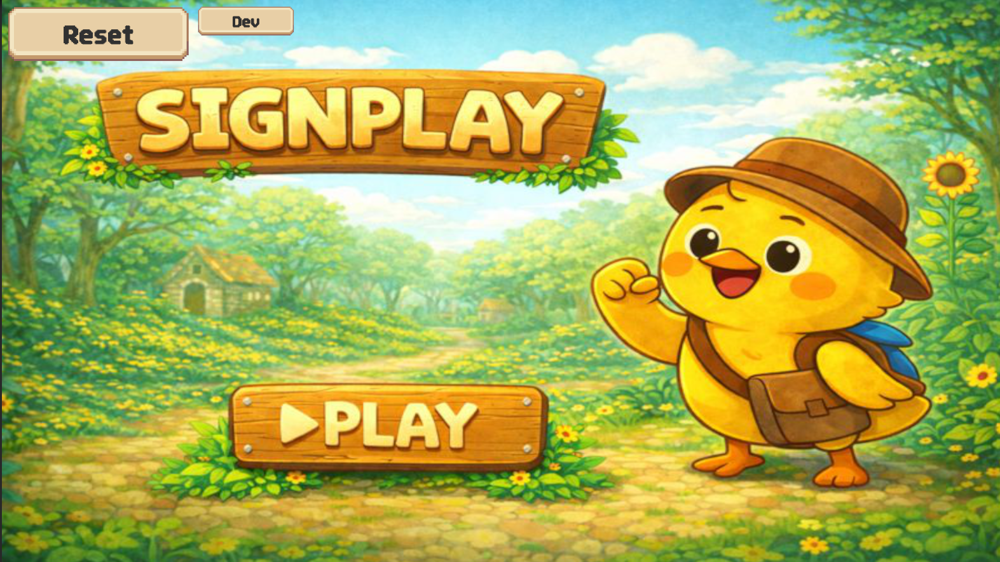
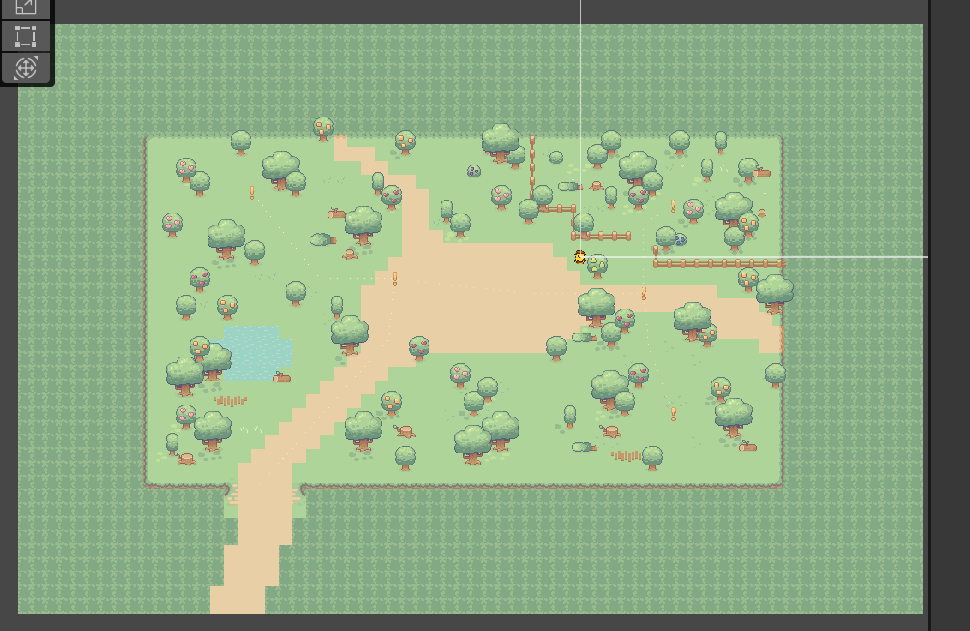
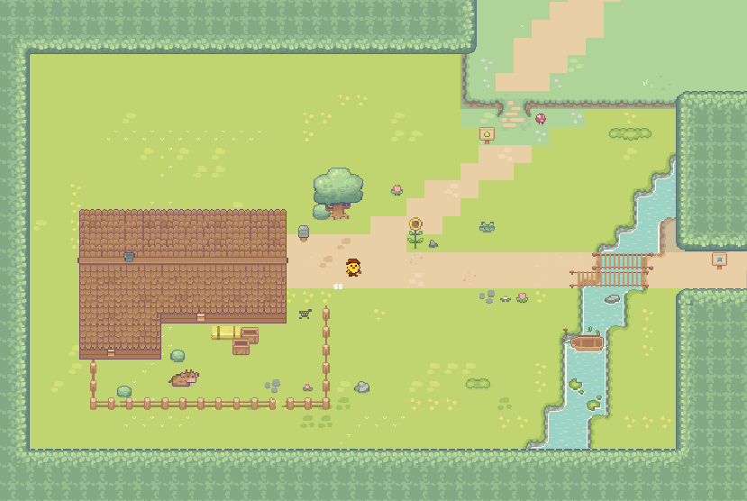
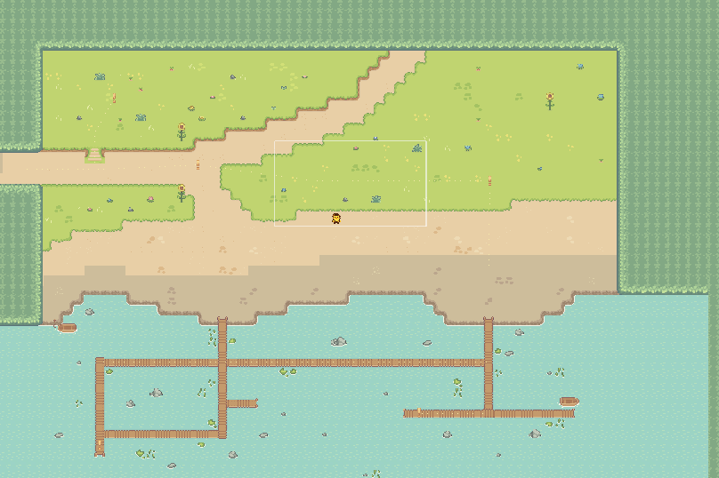
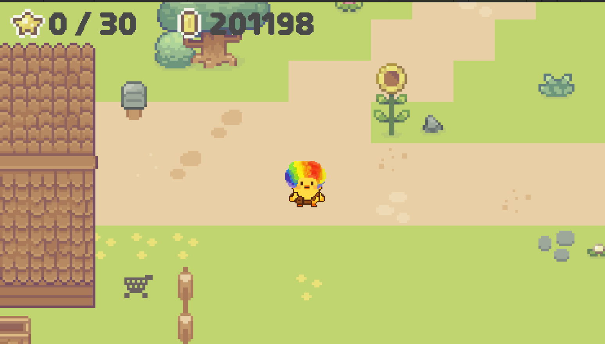
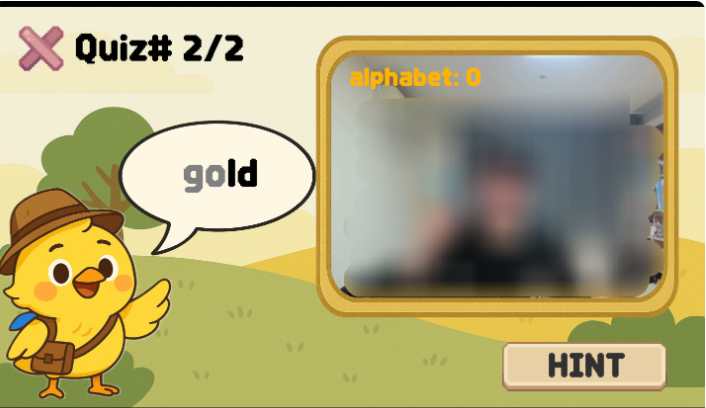
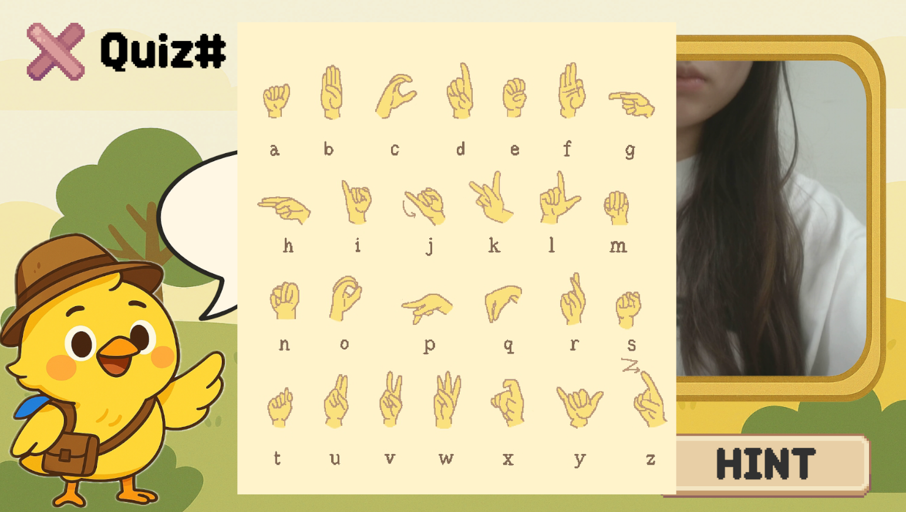
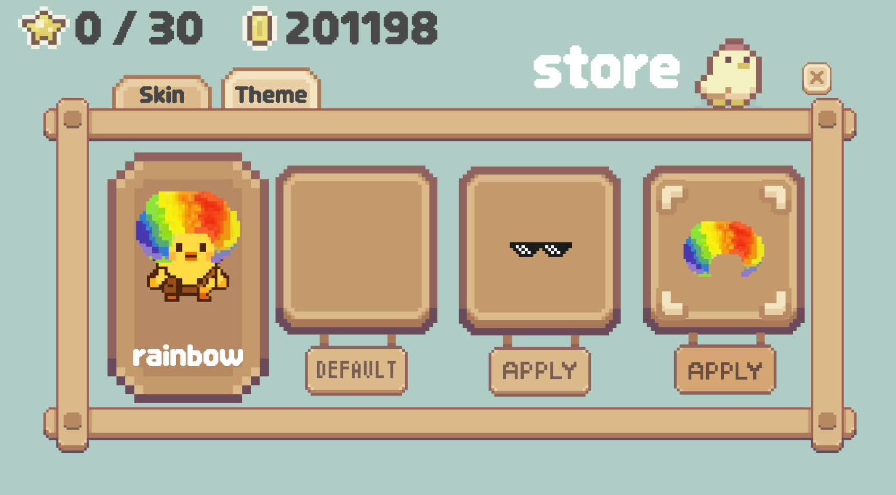

# SignPlay

> Unity와 C#을 활용해 제작한 팀 게임 프로젝트

  

---

## Overview

SignPlay은 제가 참여한 첫 대형 팀 개발 프로젝트입니다.

저는 **게임 요소 구현을 담당한 두 명의 팀원 중 한 명**으로 참여해 Unity 맵 제작, 캐릭터 이동, 맵 간 포털 등의 게임 플레이 요소를 구현했고 BGM 제작에도 참여했습니다.

> 이 저장소는 팀 프로젝트 전체 소스코드를 복제한 저장소가 아니라, 제가 직접 담당한 내용을 중심으로 정리한 개인 포트폴리오입니다.

---

## My Role

| 영역 | 담당 내용 |
|---|---|
| Map | Unity 기반 게임 맵 제작 |
| Player | C# 스크립트를 이용한 캐릭터 이동 구현 |
| Portal | 서로 다른 두 맵을 연결하는 이동 기능 구현 |
| Audio | 게임 분위기에 맞는 BGM 제작 |
| Integration | 게임 요소 구현 및 통합 작업 참여 |

---

## Key Contributions

### 1. Game Map

Unity를 이용해 플레이어가 이동하고 게임을 진행할 수 있는 여러 맵을 제작했습니다.

맵마다 서로 다른 분위기를 가지도록 구성하고, 길·오브젝트·지형 요소를 배치하면서 플레이어의 이동 동선을 함께 고려했습니다.

#### Forest Area

  

#### Village Area

  

#### Harbor Area

  

### 2. Character Movement & Exploration

C# 스크립트를 사용해 사용자의 입력에 따라 캐릭터가 움직일 수 있도록 이동 기능을 구현했습니다.

맵 안에서 플레이어가 직접 이동하고 탐색할 수 있도록 구성했으며, 이 과정에서 기능이 동작하는 것뿐 아니라 변수와 함수의 역할이 드러나도록 이름을 정하는 습관을 익혔습니다.

  

### 3. Portal

서로 다른 두 맵을 연결하여 플레이어가 한 공간에서 다른 공간으로 이동할 수 있는 포털 기능을 구현했습니다.

맵 간 이동이라는 하나의 기능을 구현하며 오브젝트와 C# 스크립트가 함께 동작하는 구조를 경험했습니다.

### 4. BGM

게임의 분위기와 플레이 경험을 고려해 프로젝트에서 사용할 BGM을 제작했습니다.

개발 요소뿐 아니라 실제 사용자가 경험하는 게임의 분위기까지 함께 고민해본 작업이었습니다.

---

## Project Screens

아래 화면은 SignPlay의 전체적인 플레이 경험과 기능 구성을 보여주는 프로젝트 화면입니다.

### Sign Language Quiz

  

제시된 단어에 맞는 수어를 수행하며 학습할 수 있도록 구성된 퀴즈 화면입니다.

### Hint

  

퀴즈 진행 중 참고할 수 있도록 알파벳별 수어 동작을 확인할 수 있는 힌트 화면입니다.

### Store

  

게임 내 캐릭터 꾸미기 요소를 확인할 수 있는 상점 화면입니다.

---

## Tech Stack

- Unity
- C#
- Git
- GitHub

---

## What I Learned

첫 대형 팀 프로젝트를 경험하면서 **코드가 동작하는 것과 협업하기 좋은 코드를 작성하는 것은 다르다**는 점을 처음 배웠습니다.

C# 스크립트를 작성하며 함수와 변수의 역할이 드러나도록 이름을 정하는 방법을 익혔고, 여러 기능을 하나의 파일에 무작정 추가하기보다 프로그램의 중심 구조를 생각하고 역할에 따라 코드 파일을 구성하는 방법을 배웠습니다.

이 경험은 이후 프로젝트에서 코드의 구조와 가독성, 다른 팀원이 이해할 수 있는 작성 방식을 의식하게 된 계기가 되었습니다.

---

## Team Project Notice

본 프로젝트는 팀 프로젝트입니다.

이 페이지에는 전체 팀의 결과물 중 **제가 직접 담당한 게임 요소를 중심으로** 정리했으며, `Project Screens`에는 프로젝트 전체 기능을 보여주기 위한 화면도 함께 포함했습니다.
